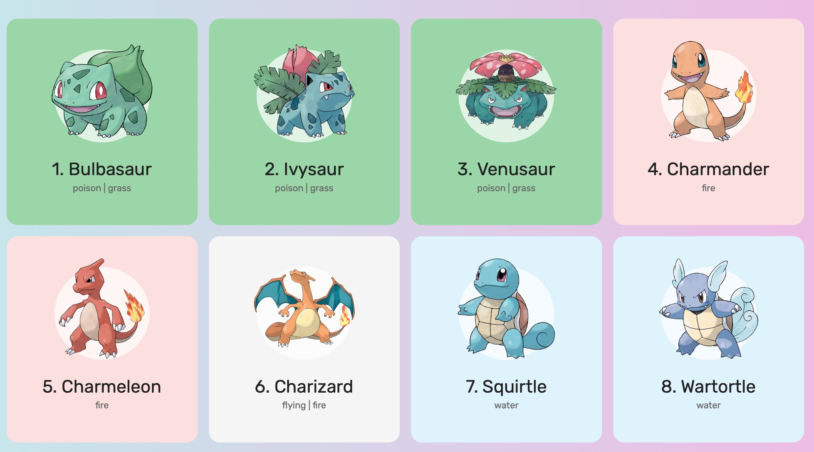

= PokeDex

Projeto originalmente desenvolvido por https://github.com/Roger-Melo[Roger Melo] que mostra como
construir uma aplicação de exemplo para exibir informações sobre Pokemons,
utilizando JavaScript puro com Promises.

A interface da aplicação é como a figura abaixo. Pode-se apenas dar dois cliques no arquivo index.html para abrir, ou utilizar o plugin https://github.com/ritwickdey/vscode-live-server[Live Server] do Visual Studio Code.

.Screenshot do index.html
